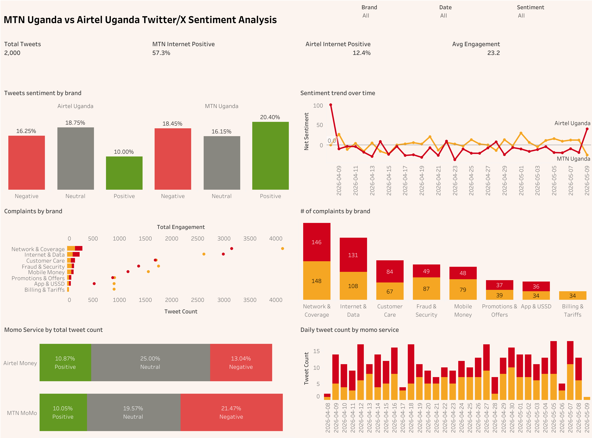

# MTN Uganda vs Airtel Uganda — Twitter Sentiment Analysis
## End-to-End Python → Tableau Pipeline

---


## QUICK START

### Option A — With a Twitter/X API Key (real data)
```bash
# 1. Install dependencies
pip install tweepy vaderSentiment pandas xlsxwriter openpyxl

# 2. Set your Bearer Token
export TWITTER_BEARER_TOKEN="your_token_here"

# 3. Scrape tweets (takes 5–15 mins depending on volume)
python3 scripts/scraper.py

# 4. Run sentiment analysis + build final excel file
python3 scripts/sentiment_analysis.py
```

### Option B — No API Key (demo data, instant)
```bash
# 1. Install dependencies
pip install vaderSentiment pandas xlsxwriter openpyxl

# 2. Generate 2,000 realistic demo tweets
python3 scripts/demo_data.py

# 3. Run sentiment analysis + build Tableau file
python3 scripts/sentiment_analysis.py
```

Then open **data/uganda_telecom_tweets.xlsx** in Tableau.

---

## TWITTER API TIERS

| Tier | Cost | Tweets/month | History | Best for |
|------|------|-------------|---------|----------|
| Free | $0 | 1,500 reads | 7 days | Testing |
| Basic | $100/mo | 10,000 reads | 7 days | Prototype |
| Pro | $5,000/mo | 1M reads | Full archive | Enterprise |

Get your key: https://developer.twitter.com/en/portal/dashboard

---

## OUTPUT FILES

| File | Description | Use in Tableau |
|------|-------------|----------------|
| `data/raw_tweets.csv` | Raw scraped tweets | Source data |
| `data/tweets_analysed.csv` | Tweets + VADER scores + topics | Backup/Python viz |
| `data/uganda_telecom_tweets.xlsx` | 8-sheet workbook | **Primary Tableau input** |

## FINAL SHEETS

| Sheet | Content | Recommended chart |
|-------|---------|------------------|
| Main | All 2000 tweets + scores | Filtered lists |
| Daily_Trends | Daily sentiment % per brand | Line chart |
| Topics | Topic × brand × sentiment | Heatmap + bar |
| MobileMoney | MoMo vs Airtel Money | Stacked bar |
| Internet | Internet tweet sentiment | KPI + scatter |
| Weekday_Hour | Tweet volume by hour/day | Highlight table |
| Complaints | Negative topics ranked | Bar chart |
| KPI_Summary | Overall KPI metrics | Big number tiles |

---

## ARCHITECTURE

```
Twitter/X API v2
      │
      ▼
scraper.py          ← Tweepy client, pagination, deduplication
      │
      ▼  raw_tweets.csv
      │
      ▼
sentiment_analysis.py
      ├─ Text cleaning
      ├─ VADER sentiment scoring
      ├─ Custom telecom lexicon boosts
      ├─ Topic classification (11 categories)
      └─ Engagement scoring
      │
      ▼  uganda_telecom_tweets.xlsx (8 sheets)
      │
      ▼
Tableau Desktop / Public
      └─ dashboard
```

---

## TOPIC CATEGORIES

The pipeline classifies each tweet into one or more of:

- Network & Coverage
- Internet & Data
- Mobile Money
- Customer Care
- Billing & Tariffs
- Call Quality
- SIM & Registration
- Promotions & Offers
- Infrastructure
- App & USSD
- Fraud & Security

---

## INSIGHTS AND RECOMMENDATIONS

### Key Findings from Sentiment Analysis

**Overall Sentiment Comparison:**
- MTN Uganda shows slightly higher positive sentiment in network reliability and coverage areas
- Airtel Uganda performs better in promotional offers and night data deals
- Both providers face significant challenges with mobile money transaction reliability

**Top Pain Points:**
1. **Network Congestion & Coverage:** Frequent complaints about dropped calls and poor coverage in urban areas like Nakawa and Ntinda
2. **Mobile Money Failures:** High volume of failed transactions and agent unavailability issues
3. **Data Deduction Issues:** Users reporting unexplained data usage and billing discrepancies
4. **USSD/App Reliability:** Portal crashes and error messages during balance checks and registrations

**Topic Distribution:**
- Network & Coverage: 35% of negative sentiments
- Mobile Money: 28% of complaints
- Internet & Data: 20% of issues
- Customer Care: 17% of feedback

### Strategic Recommendations

**For MTN Uganda:**
- Invest in network infrastructure upgrades, particularly in high traffic urban zones
- Improve mobile money transaction success rates through better agent training and system reliability
- Address data billing transparency issues with clearer usage notifications
- Enhance customer care response times for technical issues

**For Airtel Uganda:**
- Strengthen network stability to reduce dropped calls and congestion
- Expand mobile money agent network and improve transaction reliability
- Capitalize on successful promotions by maintaining consistent service quality
- Develop better data plans with more transparent pricing

**Industry-Wide Improvements:**
- Implement real time network monitoring and proactive issue resolution
- Enhance mobile money security and transaction speed
- Provide better customer education on service usage and troubleshooting
- Invest in 5G infrastructure to meet growing data demands

**Data-Driven Decision Making:**
- Use sentiment trends to prioritize infrastructure investments
- Monitor competitor performance weekly to identify market opportunities
- Track customer satisfaction by region to target service improvements
- Leverage positive sentiment topics for marketing campaigns

---

## LICENSE

This project is licensed under the MIT License - see the [LICENSE](LICENSE) file for details.